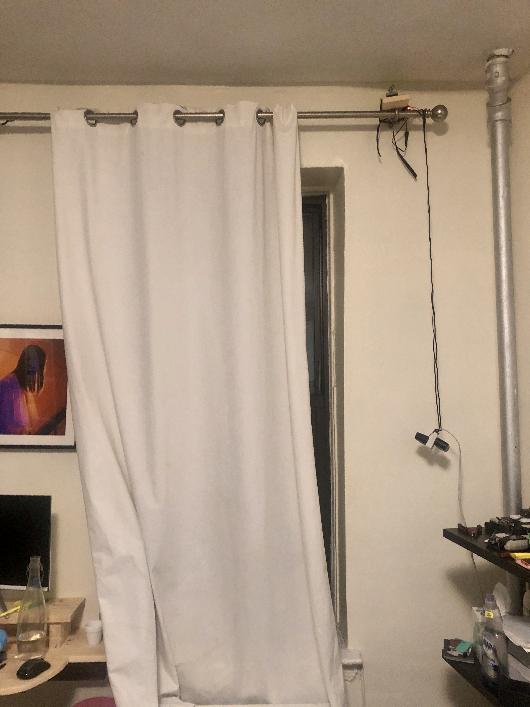

<!-- README.md is generated from README.Rmd. Please edit that file -->

# curtains

<!-- badges: start -->

<!-- badges: end -->

The goal of curtains is to build a shiny app that will control my
curtains.

## Installation

``` r
remotes::install_github("bill-ash/curtains")
```

## Example

This is a basic example which shows you how to solve a common problem:

Open my curtains from the iphone.

``` r
library(curtains)
## basic example code
curtains::makeCurtains()
```

PI running flask api connected to adafruit stepper hat zip tied to our
curtain rod.

[motor
hat](https://learn.adafruit.com/adafruit-dc-and-stepper-motor-hat-for-raspberry-pi/overview)

My gf hates me.


